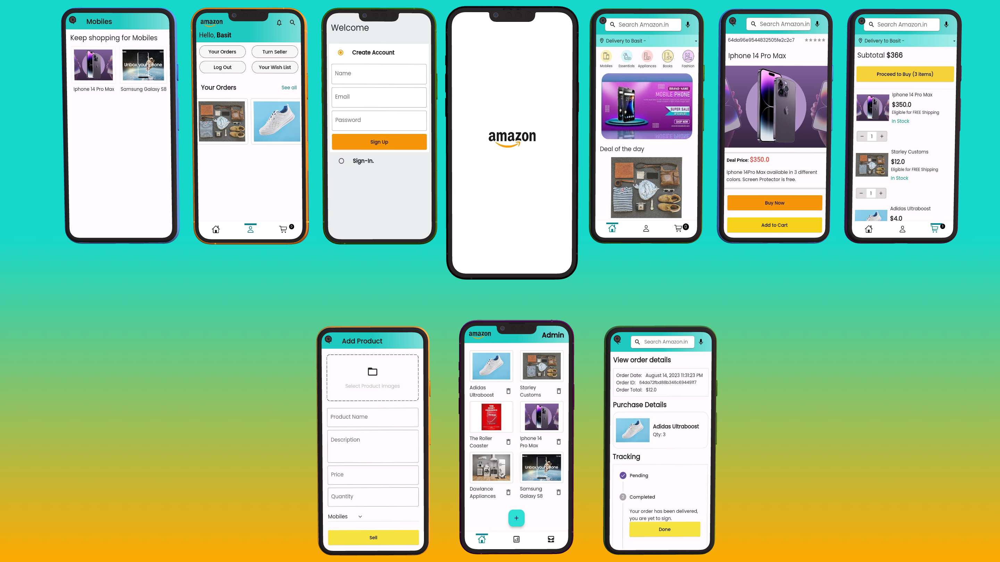

# Amazon Clone App





## A Full Stack Amazon Clone App (User & Admin) 
- Fronted UI is made with Flutter.
- Backend APIs developed with Node JS.
- Mongo db is used for cloud database.


## Tech Used
**Server**: Node.js, Express, Mongoose, MongoDB, Cloudinary

**Client**: Flutter, Provider

Then run the following commands to run your app:

### Server Side
```bash
  cd server
  npm install
  npm run dev (for continuous development)
  OR
  npm start (to run script 1 time)
```

### Client Side
```bash
  flutter pub get
  open -a simulator (to get iOS Simulator)
  flutter run
```


